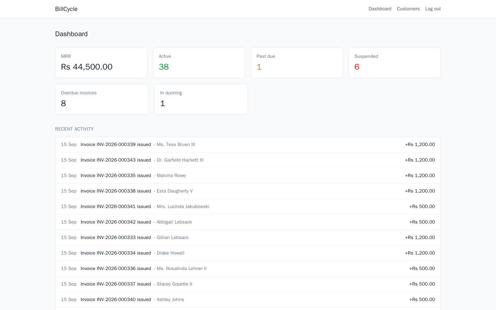
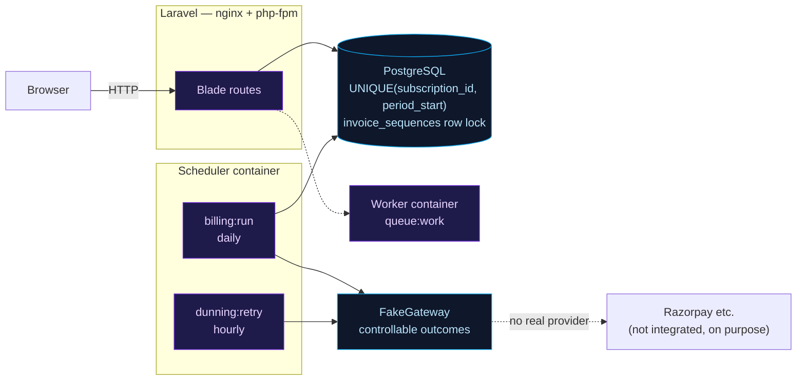
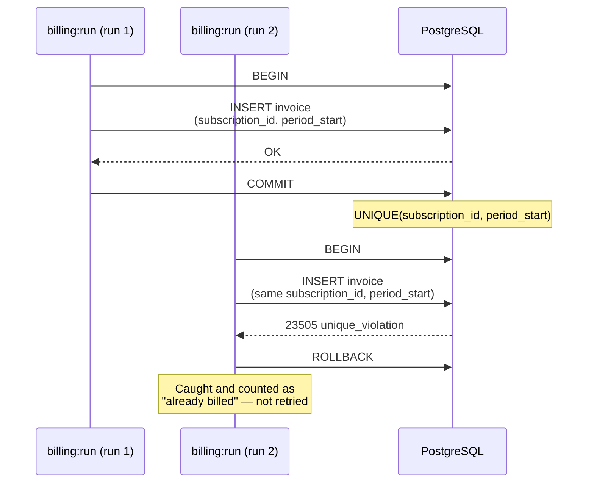
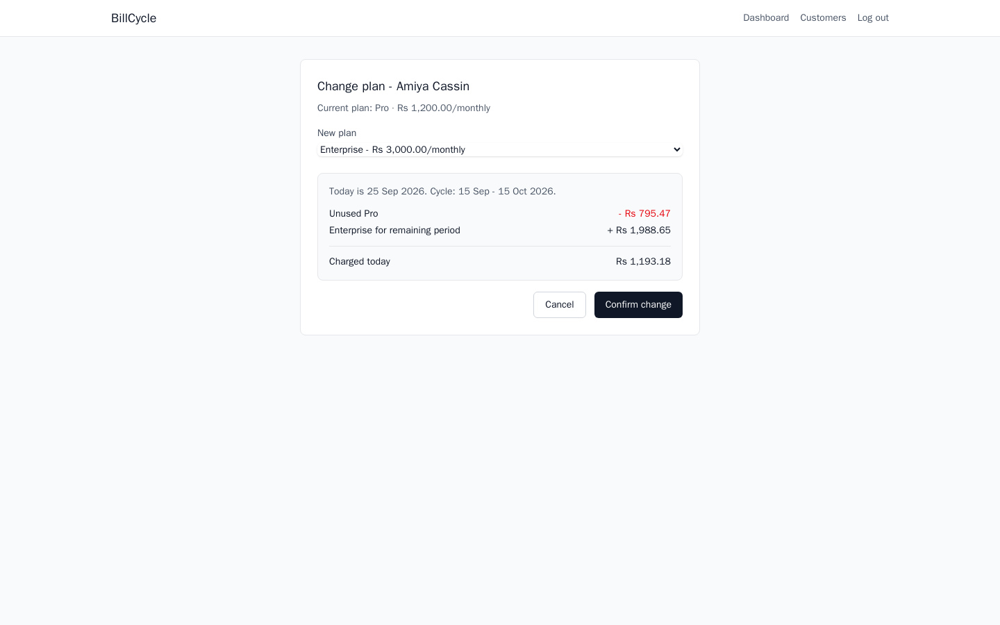
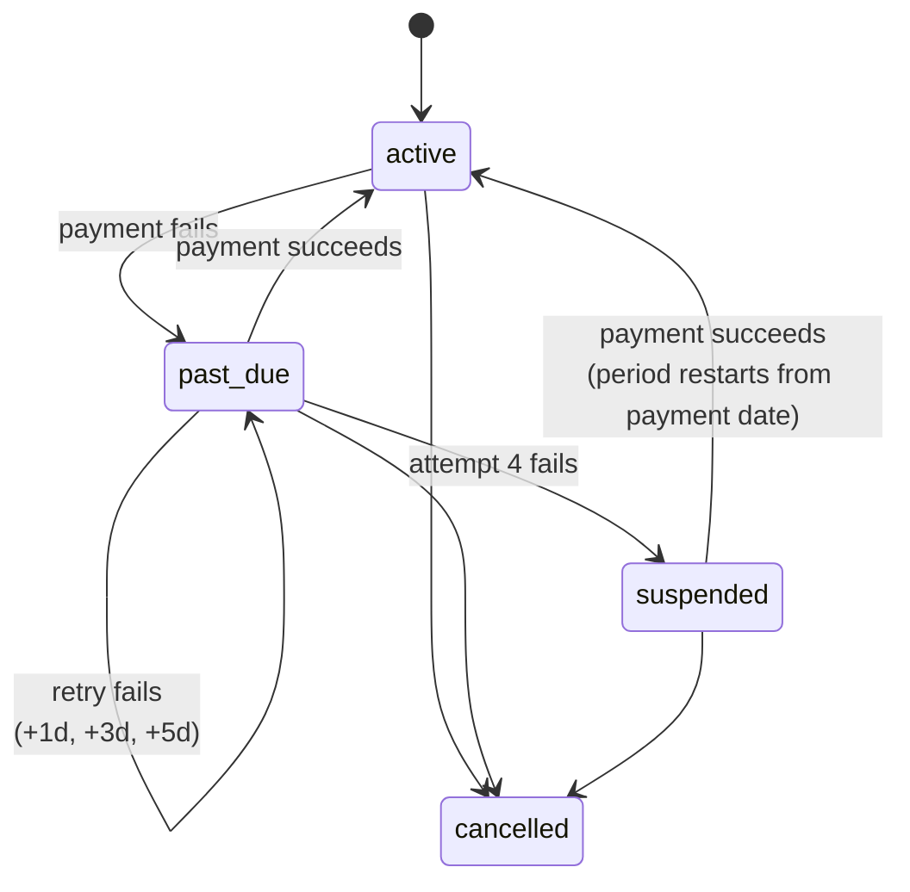
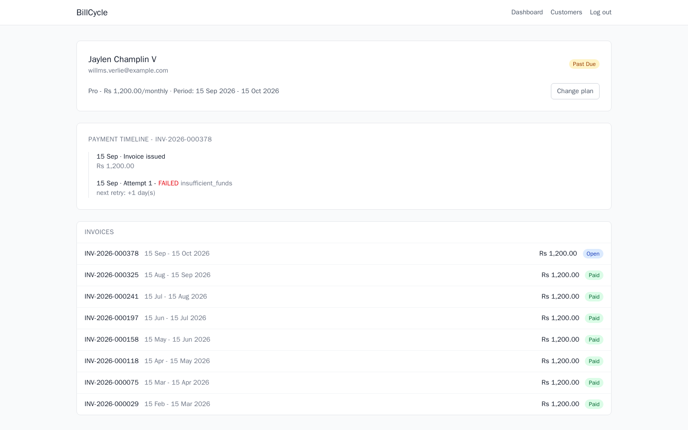
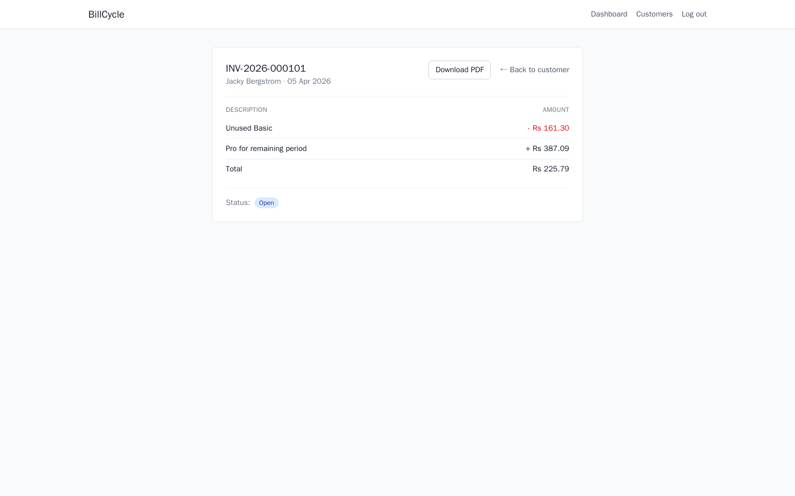
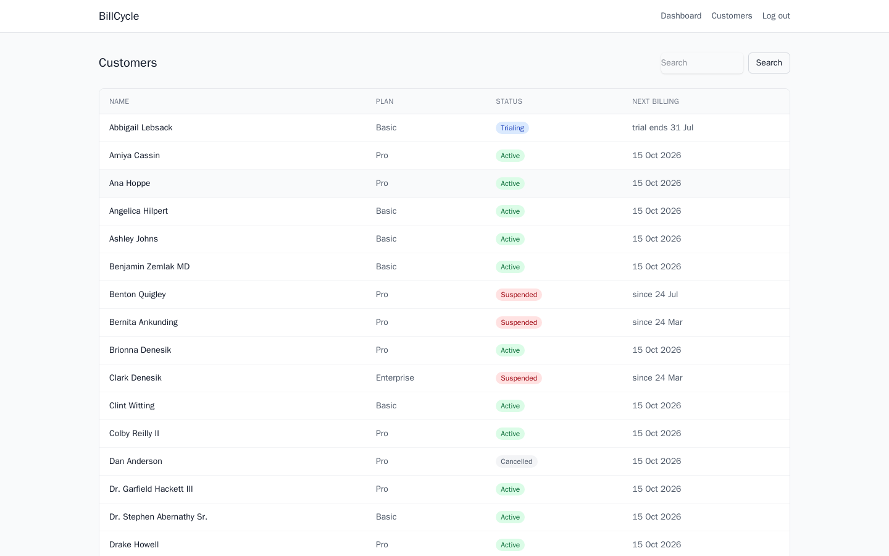

<div align="center">

# BillCycle

**Recurring subscription billing for SaaS.** When a customer upgrades mid-cycle, the proration is arithmetic, not a guess. When a payment fails, a retry schedule decides what happens next, not an `if` statement. When the billing job runs twice, exactly one invoice is created — never two.

[](https://github.com/Nitishjha7/billcycle/actions/workflows/ci.yml)
[](tests/)
[](#the-billing-job-is-idempotent-by-construction)
[](app/)
[](composer.json)
[](database/migrations/)
[](docker-compose.yml)

</div>

<p align="center">
  
</p>

<p align="center">
  <sub>50 seeded customers, 8 months of real billing history — some active, some past due, some suspended.</sub>
</p>

<p align="center">
  <a href="#quick-start">Quick start</a> ·
  <a href="#how-double-charging-is-prevented">How it works</a> ·
  <a href="#what-the-tests-actually-check">Tests</a> ·
  <a href="docs/TECHNICAL_SPEC.md">Technical spec</a>
</p>

---

## The problem

Any SaaS that charges monthly hits the same three problems, and none of them are CRUD.

**1. Someone changes plan mid-cycle.** A customer on ₹500/month upgrades to
₹1,200/month on the 15th. They have already paid for a full month of the cheaper
plan, and 15 days of it are unused. What do you charge them *today*? Get this
wrong and you either rob the customer or lose money — quietly, on every upgrade,
forever.

**2. Payments fail.** Cards expire, balances run out, banks decline. A failed
payment is not the end of the relationship — it is the start of a retry schedule.
Give up too early and you lose a paying customer; never give up and you serve a
customer who stopped paying months ago.

**3. The billing job runs again.** Cron fires twice. A deploy restarts the worker
mid-run. The queue retries a job that actually succeeded. If invoice generation
is not idempotent, a customer is charged twice — and that is real money, not a
bad row in a table.

BillCycle is built around those three, and deliberately nothing else.

---

## Overview

| | |
|---|---|
| **Backend** | Laravel 12, PHP 8.3 |
| **Data** | PostgreSQL 16 — all money as integer paise |
| **Async** | Redis queues, Laravel Scheduler |
| **Frontend** | Blade + Tailwind (server-rendered, no SPA) |
| **Payments** | A fake gateway with controllable outcomes — no real Razorpay |
| **Infra** | Docker Compose, single-image deploy (nginx + php-fpm via supervisord) |
| **Tests** | Pest, 54 passing across 7 files, 1 documented `todo` |

---

## Architecture



Three containers built from **one image**, differing only in their start
command (`docker-compose.yml`, `Dockerfile`) — the same image that runs
`nginx` + `php-fpm` together via `supervisord` for a single-service platform
like Railway also runs `billing:run` on the scheduler container and
`queue:work` on the worker container, unmodified.

---

## How double-charging is prevented

A naive `SELECT` → check → `INSERT` bills the same subscription twice under
concurrency, a retry, or a crash mid-run. BillCycle puts the guarantee in the
schema, not in application code that remembers to check.



| Layer | Mechanism | Role |
|---|---|---|
| 1 | `UNIQUE (subscription_id, period_start)` | The actual guarantee — holds even if application code is wrong |
| 2 | Transaction per subscription | Invoice creation and period advance commit together or not at all |
| 3 | Status re-checked inside the transaction | A subscription cancelled between selection and processing is skipped, not billed |

The same **atomic insert / catch-and-count** pattern is what makes the
[twelve-month billing test](tests/Feature/BillingRunTest.php) and the
run-three-times-in-a-row test possible without mocking anything.

---

## Proration is a pure function

```php
ProrationCalculator::calculate($oldPlan, $newPlan, $changeDate, $cycleStart, $cycleEnd)
// → ProrationResult { creditPaise: 25000, chargePaise: 60000, netPaise: 35000 }
```

No database, no clock, no side effects — inputs in, amounts out. It takes a
`PlanPricing` interface rather than the Eloquent `Plan` model directly, so
the calculator and its whole test suite never touch a database connection.
That is what makes the 16 edge-case tests around it run in milliseconds: a
28-day February, a change exactly on the cycle boundary, a free-to-paid plan
swap, a downgrade that leaves credit behind instead of a refund.

Called **twice** for a single plan change — once from the preview endpoint,
once from the apply path inside a transaction, both with identical inputs —
so the confirmation screen a customer sees and the invoice they actually get
are structurally unable to disagree.

<p align="center">
  
</p>

<p align="center">
  <sub>The preview calls the same pure function the apply path uses — this screen cannot show one number and charge another.</sub>
</p>

---

## Dunning is a state machine, not a cron with `if`s



Retry intervals widen — +1, +3, +5 days — rather than staying fixed: an
immediate retry after `card_declined` will decline again, whereas
`insufficient_funds` may resolve on payday. `SubscriptionStateMachine`
enforces the transitions above as an explicit allow-list; anything not
listed throws `LogicException` instead of silently no-opping.

<p align="center">
  
</p>

<p align="center">
  <sub>Rendered from <code>payment_attempts</code> — kept as its own table specifically so this timeline has real rows to render.</sub>
</p>

---

## Money is never a float

Every monetary value in this system is an **integer count of paise**, and every
column and variable says so: `price_paise`, `credit_paise`, `total_paise`.

`0.1 + 0.2 !== 0.3` is not a trivia question when you are dividing a monthly
price across 30 days, taking 15 of them, and doing it a few thousand times a
month. Rounding is applied once, explicitly, at a named boundary: the
remainder always favours the customer (credit rounds up, charge rounds
down), so the maximum possible cost of a rounding decision is one paisa per
plan change — a documented decision, not an accident of the language.

<p align="center">
  
</p>

<p align="center">
  <sub>The negative line is the visible proof that credits are line items, not a separate concept — <code>SUM(amount_paise) == invoices.total_paise</code> is a checkable invariant on every invoice.</sub>
</p>

---

## What the tests actually check

```bash
php artisan test
#   Tests:  1 todo, 54 passed (128 assertions)
```

| File | Tests | What it pins down |
|---|---|---|
| `ProrationCalculatorTest` | 16 + 1 todo | Every edge case: cycle boundaries, leap years, free/paid swaps, rounding direction. The `todo` is a documented, known limitation — a second plan change on the same day double-credits — left failing on purpose rather than silently unfixed. |
| `BillingRunTest` | 12 | A simulated **12-month** billing run producing exactly 12 invoices; running the job **3 times in a row** producing exactly 1 invoice; a forced crash mid-transaction leaving no partial invoice. |
| `DunningTest` | 11 | A customer driven **failed → failed → failed → suspended → paid → active** end to end, with every transition checked. |
| `ChaosTest` | 1 | **500 random events** (upgrade, downgrade, cancel, pay, fail payment, advance the clock) against 20 customers, then one invariant checked for every customer: `invoiced − paid == outstanding`. Seeded, so a failure is reproducible. |
| `InvoiceTest` | 9 | Gapless sequential numbering, including a forced rollback between number allocation and commit — the next invoice reuses the number rather than leaving a gap. |
| `PlanChangeTest` | 4 | Preview and apply produce identical numbers for identical inputs. |
| `SmokeTest` | 1 | The whole stack — migrations, factories, relationships — actually boots. |

Tests drive the clock with `Carbon::setTestNow()` rather than waiting on a
real one, which is what makes a 12-month simulation run in milliseconds
instead of a year.

---

## Two bugs worth mentioning

**A silent off-by-one in the due-subscription query.** The billing job
originally compared a `datetime` column to a bare date string:
`current_period_end <= '2026-02-01'`. Against a stored value of
`'2026-02-01 00:00:00'`, that comparison is **false** lexically — so a
subscription due exactly today was silently skipped, every time. The
twelve-month test caught it immediately by coming back with 11 invoices
instead of 12. Fixed by comparing against `endOfDay()` instead of a bare
date.

**A green test suite that wasn't testing what it looked like it was
testing.** `docker-compose.yml` passes `.env` into the app container via
`env_file:`, so `DB_CONNECTION=pgsql` existed as a real process environment
variable — and PHP's `getenv()` treats a real env var as higher priority
than `phpunit.xml`'s `<env>` block. Every `php artisan test` run was
quietly hitting real Postgres over the network instead of the fast
in-memory SQLite the suite was written for. Nothing failed — the suite was
just 30–70× slower than it should have been, which is exactly the kind of
drift that goes unnoticed because green stays green. Caught by the timings
looking wrong, not by an assertion failing. Fixed with `force="true"` on
each `DB_*` entry in `phpunit.xml`.

---

## Quick start

Only Docker Desktop is required.

```bash
git clone https://github.com/Nitishjha7/billcycle.git
cd billcycle

cp .env.example .env
php -r "echo 'APP_KEY=base64:'.base64_encode(random_bytes(32));"
# paste the output into .env as APP_KEY=...

docker compose up -d --build
docker compose exec app php artisan migrate
docker compose exec app php artisan db:seed --class=DemoSeeder
```

| Service | URL |
|---|---|
| App | http://localhost:8004 |
| Postgres | localhost:5436 |

**Demo login:** `admin@billcycle.demo` / `password`

Ports are offset from common defaults so this can run alongside other local
projects at the same time.

---

## Screens

| # | Route | Screen |
|---|---|---|
| 1 | `/` | Dashboard — MRR, status counts, recent activity |
| 2 | `/customers` | Customer list — all five statuses, searchable |
| 3 | `/customers/{id}` | Customer detail — the dunning timeline |
| 4 | `/customers/{id}/change-plan` | Plan change — the proration preview |
| 5 | `/invoices/{id}` | Invoice detail — line items, including negative ones, plus PDF download |

<p align="center">
  
</p>

---

## Deliberate non-goals

Scope discipline is part of the design. These are **not** being built, and each
was rejected for a reason:

- **Real payment gateway integration** — a fake gateway with controllable
  outcomes tests the dunning logic *better*, because failures can be produced on
  demand instead of hoped for.
- **Multi-currency** — would add conversion and rounding concerns that dilute the
  proration work rather than deepen it.
- **Tax / GST rules** — jurisdiction rules are a research problem, not an
  engineering one.
- **Usage-based metering** — a different billing model entirely; it would double
  the surface area and halve the depth.

---

## Documentation

| Doc | What is in it |
|---|---|
| [docs/TECHNICAL_SPEC.md](docs/TECHNICAL_SPEC.md) | Schema, proration algorithm, dunning state machine, idempotency design |
| [docs/UI_FLOW.md](docs/UI_FLOW.md) | The five screens, what each shows, and the seed data behind them |
| [docs/SETUP.md](docs/SETUP.md) | Getting it running locally |
| [docs/DEPLOYMENT.md](docs/DEPLOYMENT.md) | Railway + Neon, why those, and what to verify after |

---

## License

MIT
